<p align="center">
  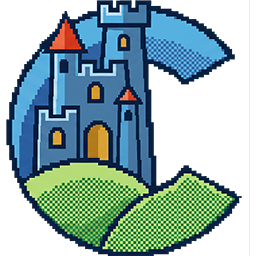
</p>

# CastaliaOS 98 PE — Powerful Edition

An original, legally clean, **Win9x-inspired retro desktop environment** for
late-1990s IBM Pentium II / Intel 440BX-class hardware. CastaliaOS 98 PE boots
on top of **FreeDOS**, takes over the graphical session, and presents a fast,
repairable desktop with a window manager, taskbar, launcher, and first-party
applications — built as a disciplined engineering project, not a toy.

> CastaliaOS 98 PE is **not** Microsoft Windows and contains **no** Microsoft
> code, files, icons, sounds, fonts, or branding. It is an original work
> inspired by the late-1990s desktop idiom. See [LEGAL.md](LEGAL.md).

> **Created by Dave Abellan and Claudio di Castello** — Tombatossals Softworks.
>
> **Press & media:** a complete press kit (fact sheet, screenshots, logos,
> technical details, roadmap, and an animated trailer) lives in
> [`presskit/`](presskit/) — open [`presskit/index.html`](presskit/index.html).
> Contact: hello@tombatossalssoftworks.com

<p align="center">
  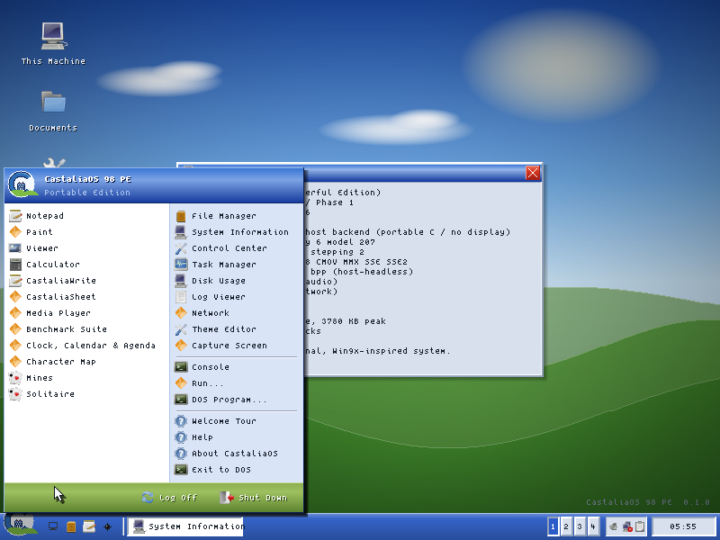
  <br><em>The 800×600 desktop, rendered by the host build (<code>make run</code>). Not a mockup — this is the actual composited framebuffer.</em>
</p>

---

## Why this exists

The project separates three things retro projects usually blur:

| Track | What it is | Status |
|-------|-----------|--------|
| **Mode A — Castalia DOS Shell** | FreeDOS-hosted 32-bit graphical desktop. The flagship product. | **Active (this repo)** |
| **Mode B — Win98 Shell companion** | An optional Win32 shell that runs on a user's own legal Windows 98 SE. Prototype only. | Roadmap (Phase 6) |
| **Mode C — Native kernel lab** | An isolated bootloader/kernel research track. Must never block Mode A. | Roadmap (`/kernel-lab`) |

The design goal is *"a lost 1999 professional desktop made by a small European
engineering team with taste"*: predictable behavior, fast dirty-rectangle
redraw, clear affordances, recoverable failures, and no heroic lies.

## The key architectural idea

Every external dependency sits behind a **Castalia-owned interface**
(`include/castalia/*.h`). The whole stack **above the platform layer is
portable C89** and has **two interchangeable platform backends**:

- **`src/platform/host/`** — a headless framebuffer backend that renders into
  memory and writes a screenshot. It builds and runs with any C compiler, so
  the entire shell is **buildable, runnable, and testable on a normal machine
  (and in CI)** today. This is what produces the screenshot below.
- **`src/platform/dos/`** — the real product backend: VESA/VBE graphics, PS/2
  mouse (INT 33h), keyboard (INT 16h), timers, DOS file I/O, and DOS child-
  process launch via **Open Watcom**. It is compiled *only* by the DOS
  makefile, so DOS-specific code can never break host portability.

```
Layer 0  BIOS + FreeDOS boot            (AUTOEXEC.BAT -> CBOOT.EXE -> CASTALIA.EXE)
Layer 1  Platform abstraction  plat.h   (host backend | dos backend)
Layer 2  Runtime services      sys_/cfg_ (log, config INI, memory, crash)
Layer 3  Graphics + window mgr gfx_/wm_/ui_ (surfaces, dirty rects, controls)
Layer 4  Shell                 sh_      (desktop, taskbar, launcher, cursor)
Layer 5  Applications          app_     (System Info now; more per roadmap)
Layer 6  Extensions                     (.CAPP, themes, sound, net, kernel lab)
```

Full detail: [docs/ARCHITECTURE.md](docs/ARCHITECTURE.md).

## Try it in 60 seconds (no DOS, no Watcom)

```sh
./build.sh          # builds the host shell, runs unit tests, renders a demo
# -> build/castalia.bmp   (open in any image viewer)
# -> build/run_tests      (7547 checks)
```

Or step by step:

```sh
make            # build the host shell
make test       # 7547 unit checks across 58 suites (INI, rect, regions, strings, installer,
                #   sound, color, .CAPP, net + the ARP/IP/ICMP/UDP stack, clipboard, snapping,
                #   mines, spreadsheet, word processor, Paint, agenda, EQ, theme, paths,
                #   thumbnails, associations, calculator, Klondike, word wrap,
                #   the parsers fed deliberately damaged input,
                #   the Character Map grid, and file-size totals)
make demos      # every end-to-end scene, failing on any MISMATCH
make run        # render build/castalia.bmp (desktop + launcher + System Info)
tools/run_host.sh 640 480   # render the 640x480 fallback mode
```

## Get the ready-to-use build (no toolchain)

The [`RELEASE/`](RELEASE/) folder is the **fully compiled** product, checked in
so it ships with the source: the `C:\CASTALIA` tree with `CASTALIA.EXE`,
`CBOOT.EXE`, `INSTALL.EXE` **and** the bundled `DOS4GW.EXE` extender. Copy
`RELEASE/CASTALIA` to a FreeDOS drive and run `BIN\CBOOT.EXE` — nothing else to
install. See [`RELEASE/README.md`](RELEASE/README.md).

Those binaries are a **snapshot, not a mirror of `src/`**: building them needs
Open Watcom, which is not available in every environment this source is worked
on, so the folder is refreshed deliberately rather than on every commit. The
version currently checked in was built from `8ab8369` (2026-07-08); work merged
after that is in the source but not yet in the compiled folder. `RELEASE/README.md`
says how to rebuild it and how to check which one you have.

## Build the real DOS product

Under an Open Watcom environment:

```sh
wmake -f Makefile.dos            # -> dist/cdroot/CASTALIA/BIN/CASTALIA.EXE, CBOOT.EXE, INSTALL.EXE
tools/make_release_folder.sh     # -> RELEASE/ (staged install tree + bundled DOS4GW.EXE)
```

Then install onto a FreeDOS disk/image and boot it. See
[docs/BUILDING.md](docs/BUILDING.md) and [docs/TESTING.md](docs/TESTING.md)
(QEMU/Bochs profiles in `emulators/`).

## Repository map

```
include/castalia/   Public, Castalia-owned interface headers
src/sys  src/cfg    Layer 2 runtime (log, safe strings, memory, crash, INI)
src/gfx             Layer 3 software renderer (rects, blits, bevels, 8x8 font)
src/wm  src/ui      Window manager + common controls
src/shell           Desktop, taskbar, launcher, cursor, theme
src/apps            Built-in application windows
src/capp            .CAPP add-on package format, validator, discovery
src/net             Networking helpers (address/checksum) + seam
src/install         INSTALL.EXE core (tree, boot-file backup, boot entry)
src/platform/host   Headless backend (builds here)
src/platform/dos    VESA/PS-2/DOS backend (Open Watcom only): + LFB, Sound
                    Blaster DAC, packet-driver client
src/boot/cboot.c    CBOOT.EXE safe launcher
tests/              Host unit tests
emulators/          QEMU + Bochs run scripts
dist/               AUTOEXEC/CONFIG templates + installed C:\CASTALIA layout
RELEASE/            Ready-to-use build tree (fill with tools/make_release_folder.sh
                    after the Open Watcom build; docs + boot templates ship here)
include/vendor/     Optional pinned third-party binaries. Absent, the DOS4GW.EXE
                    extender comes from the Open Watcom install that builds it.
assets/themes/      Original theme files
docs/               Architecture, building, testing, recovery, backlog, legal,
                    the Project Bible, and the source design brief
kernel-lab/         Isolated native-kernel research track (does not block v1)
```

## Status

**Phase 1 MVP is real and verifiable today**: the host build boots to a
composited desktop with a stone-gradient wallpaper + castle motif, original
procedural icons, a working window manager (drag, focus, z-order, caption
buttons), a taskbar with launcher/tasks/clock, an open launcher menu, a
software cursor, and a live **System Information** window — all in a **3.7 MB
idle footprint**, under half the 8 MB budget. Almost all of it is two
800×600×32 surfaces at 1875 KB each: the back buffer everything renders into,
and the desktop cache that makes a steady-state repaint a row copy instead of a
per-pixel gradient. `make demos` enforces a 4 MB idle ceiling, so this figure
cannot drift the way it already did once (it read 1.9 MB — one back buffer —
for a long time after the cache added the second).

**Phase 2 has started**: a real **File Manager** (`src/apps/app_fileman.c`) —
details listing through the platform directory API, directories-first sort,
folder navigation, keyboard control, a toolbar, **New Folder**, and safe
**delete-to-Trash** — plus **CI** (`.github/workflows/ci.yml`) that builds with
gcc *and* clang, runs the unit tests, and uploads the rendered desktop on every
push and PR.

<p align="center">
  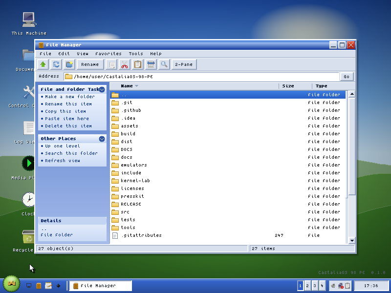
</p>

Built-in apps and UI now include a **File Manager** with a **Windows XP-style
Explorer** shell — menu bar, address bar, a blue **task pane** ("File and Folder
Tasks" / "Other Places" / "Details"), Details / Tiles / **Icons** views with
**live image thumbnails** (decoded a few per frame into a bounded cache, so a
folder of a hundred bitmaps fills in over a second instead of stalling one
long frame),
sortable columns, a navigable address bar, **right-click context menus**,
**file associations** (a double-click opens a `.BMP` in Paint, a `.CSV` in
CastaliaSheet, a `.DOC` in CastaliaWrite, a `.WAV` in the Media Player, text in
Notepad, and anything unclaimed in the Viewer — the same table names the Type
column and the Properties dialog, so all three always agree),
**drag-and-drop** (move a file onto a folder or between panes),
**Compress / Decompress** (right-click a file to write a `.CZ` copy with the
built-in LZSS coder, or open one to get the file back under the name its
header remembers — 8.3 means `NOTES.TXT` becomes `NOTES.CZ`, so the original
name travels inside), **Back Up to `.CAR`** (a whole folder in one archive,
restored by opening it — members carrying a path are refused rather than
written, so an archive cannot be talked into writing outside the folder it is
restored into), and a
**Properties** dialog (type / location / size, with folders walked for their
totals and WAVs reporting format + length), plus the full browse / copy / cut /
paste / rename / delete-to-Trash / search / two-pane toolset — where **Find**
matches a file's name *or* the text inside it and tells you which line, and the
**Recycle Bin** gives every deleted file its own slot, remembers where it came
from, and puts it back there (two files called `NOTES.TXT` from two folders
each return to their own; deleting the second used to destroy the first) — **Notepad** (multiline editor with open/save, Find, **word-wrap**, and
full **text selection + cut/copy/paste** via a system clipboard shared across
apps), a **Task Manager** (live window list, memory gauge, activate / end task,
and a **Performance panel** graphing memory and frame time over the last
minute), **Disk Usage** (a squarified treemap where a rectangle's area is its
share of the folder — one level of nesting shows what is inside the biggest
folders, colours come from the same association table the File Manager uses,
and the scan is bounded and says so when it hits the bound),
a **File Compare** (pick two text files and see what changed between them:
the lines only in one, only in the other, and the ones that differ, each with
its line number — a resynchronising compare in the spirit of DOS's own `FC`,
also available as `fc A B` in the Console, and one that treats a CRLF file and
an LF file with the same text as identical, because on a system whose editors
write one convention and whose archives carry the other, a compare that calls
every line different is one nobody can use),
an **Archive viewer** (open a `.CAR` and see what is in it — name, original and
stored size, and how many members already exist where they would land — read
from the archive's directory alone, without decompressing a byte; opening one
used to unpack it on the spot over whatever was already there, and both the
viewer and the File Manager's Restore now **ask before replacing anything**,
but only when there is something to lose),
**Calculator**, **CastaliaWrite** (a word processor in the 2001 office idiom: menu bar with
working drop-downs, flat-until-hovered Standard and Formatting toolbars, a
ruler, a white page on a gray workspace, live word-wrap, per-character
**bold**/*italic*/underline, per-paragraph alignment, drag-selection, and
save/load to a plain repairable markup, with the document model unit-tested in
`tests/test_write.c`),
**CastaliaSheet** (a real spreadsheet in the same idiom: a three-sheet
workbook with tabs, menu bar, Σ/fx toolbar, Name Box + formula bar, A1 grid,
cell references and ranges, `SUM`/`AVG`/`MIN`/`MAX`/`COUNT`/`ABS`/`INT`/`ROUND`, Auto-Sum, **CSV
save/load that preserves formulas**, and
`#DIV/0!`/`#CYCLE!` error cells, with the engine unit-tested in
`tests/test_sheet.c`), a **Media Player** (a Winamp-style WAV player: green LCD, a live
**spectrum/oscilloscope visualizer** driven by the real decoded samples,
transport + seek + volume/balance, **shuffle / repeat**, a remaining-time
toggle, and a **drag-to-reorder** playlist that can add a file or scan a whole
folder for WAVs), a
**Clock, Calendar & Agenda** (a live analog clock with a sweeping second hand, a
digital readout, a navigable monthly calendar, and an appointment panel: pick a
day, add an entry, and days that have something scheduled carry a dot under the
number — saved to `SYS\AGENDA.TXT` as one plain line per appointment), a **Character Map** (a glyph grid to
pick characters into a sample string and copy them to the clipboard), a
**Console** (a DOS‑flavored command shell with real built‑ins — `dir`, `cd`,
`type`, `mem`, `ver`, `echo`, `cls` — command history, and a blinking cursor), a
**Benchmark Suite** (live CPU /
memory / graphics
micro-benchmarks reported as animated bar meters with an overall **CastaliaMark**
score), a spectacular tabbed **About** window (identity, hardware, live
**source-code statistics**, and credits), **Mines** (the classic hidden-mines
grid puzzle — first-click-safe, flood reveal, flags, timer, fully
keyboard-playable, with its board logic host-tested in `tests/test_mines.c`),
**Solitaire** (the classic Klondike patience game — full rules, click-to-move,
double-click-to-foundation, **drag-and-drop cards and runs** with a floating
ghost, a felt-green table, and the classic **bouncing-cards win cascade**),
**FreeCell** (the other patience game, with every card face up and no luck
left in it — four free cells, four foundations, eight cascades, click-to-pick
and click-to-place, and the supermove rule stated on the status bar so you can
see how many cards you may actually move, plus **New Game** and a **Send
Home** that clears every card it can to the foundations at once),
**CastaliaPaint** (a raster editor in the 9x idiom: a two-column tool box with
**eleven tools** — pencil, brush, airbrush, eraser, fill, color picker, line,
rectangle, ellipse, text and a **rectangular selection** — an options box for
brush width and the three shape styles, the 28-swatch palette with a
foreground/background pair (right-click sets the background), **cut / copy /
paste** of any region, **Stretch** by a percentage, **three levels of
undo/redo**, Flip / Invert / Grayscale, and a 24-bit **BMP round trip**, with
every pixel operation host-tested in `tests/test_paint.c`), a
**Theme Editor** (every color the shell draws with, an RGB mixer and a quick
palette, title-bar and border metrics, and a **live miniature preview** of the
desktop — apply it to the running session or save it as a plain INI you can
send to somebody), a
**Network** window (adapter and link status, the TCP/IP configuration, the live
ARP table, and a **ping** tool that resolves the address with ARP and matches
each ICMP echo reply to its request — while it is open the machine also answers
ARP requests and echo requests addressed to it), a
**Log Viewer** (color-coded, scrollable tail of the session log), a **Control
Center** (theme, **desktop wallpaper** (bundled originals, applied live),
**screen saver** (four modes with a live preview), clock, and boot settings
persisted to `CASTALIA.INI`), a **Welcome tour** on first boot (live links to
the key apps; dismissible, reopenable from the launcher), a **Help browser**
(topics on the left, the text on the right — the shortcuts, which app owns
which file type, and where everything lives on disk), System
Information, and reusable controls: **buttons, menus, a text field, checkbox,
radio, listbox**, **modal dialogs**, and a shared **Open / Save As file
dialog** — every app that reads or writes a file now browses a real folder
listing (folders first, an extension filter, a scroll bar, keyboard
navigation) instead of asking you to type a path.

The shell behaves like the systems it is inspired by — and, in places, better
than Windows 98 SE: a **two-column XP-style Start panel** (a Programs column, a
Places & System column, a glossy crested header, and a green footer with Log
Off / Shut Down) with **full keyboard navigation** (arrows move within and
between columns, Enter launches),
**right-click desktop context menus** (including **Capture Screen**, which
writes the screen to `PHOTOS\SHOTnnnn.BMP`), **glossy buttons and scrollbars**
(a face lit from above, inverted when pressed, flat when disabled), **XP-styled pop-up menus**
everywhere (a tinted icon gutter, a near-white body, a gradient selection with
a darker rim, and engraved disabled entries — all of it derived from the active
theme's own colours, and all of it switched off on the 16/256-colour pipelines
and in safe mode, where the menus stay flat), a **Quick Launch strip** beside the
Start button (Show Desktop, File Manager, Notepad, Mines — the Win98 SE
taskbar signature, with **Show Desktop** minimizing every window to its
taskbar button in one click), **hover tooltips** (rest the pointer on a task
button, the Start orb, a tray icon, or the clock and an info-yellow tip pops —
the clock's shows the **full weekday date**, and clicking the clock opens the
**Clock, Calendar & Agenda**), an **Alt+Tab switcher** (a panel of open windows with their icons, walking
**most-recently-used** order so one press returns you to the window you were
just in and a second brings you back; Shift+Alt+Tab rotates the other way,
through every window in turn),
**window resize** by dragging
any edge, **maximize** that reserves the taskbar, **drag-to-edge window
snapping** with a **live preview outline** (left/right halves, top = maximize —
a gesture Win98 SE never had),
**arrow keys across the desktop icons** with Enter to open one (they were
reachable by mouse and in no other way), **Alt+Tab** window switching,
**Alt+F4** close, a **window menu** on
**Alt+Space** (or a right-click on a title bar or a taskbar button) carrying
Restore / **Move** / **Size** / Minimize / Maximize, **Send to Desktop 1–4** and
Close — Move and Size borrow the arrow keys (Enter keeps the result, Esc puts
the window back exactly where it was), so every window command is reachable
without a mouse, and a window can be moved between virtual desktops at all,
**double-click the title bar**
to maximize, **single-click-to-select / double-click-to-open** desktop icons
that you can also **drag anywhere on the desktop** (with a floating ghost, and
positions that **persist** to `CASTALIA.INI`) and **right-click** for a
per-icon menu (Open, plus Empty Recycle Bin on the bin), and **Shift-select /
Ctrl+A/C/X/V** text editing with a system clipboard.

<p align="center">
  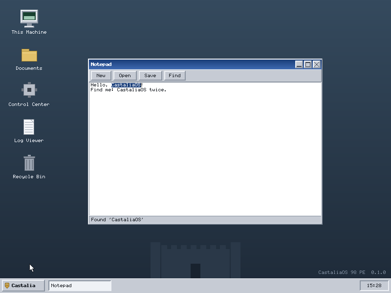
  
  <br>
  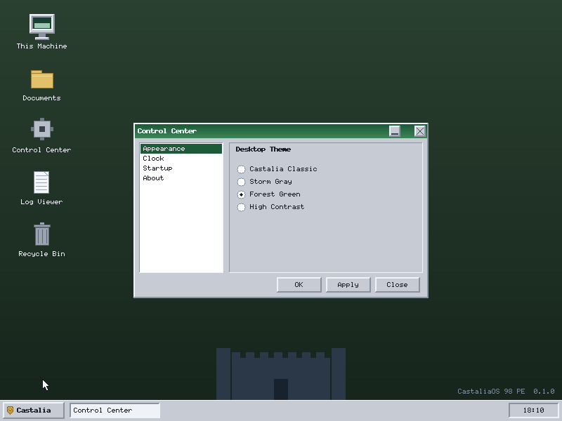
  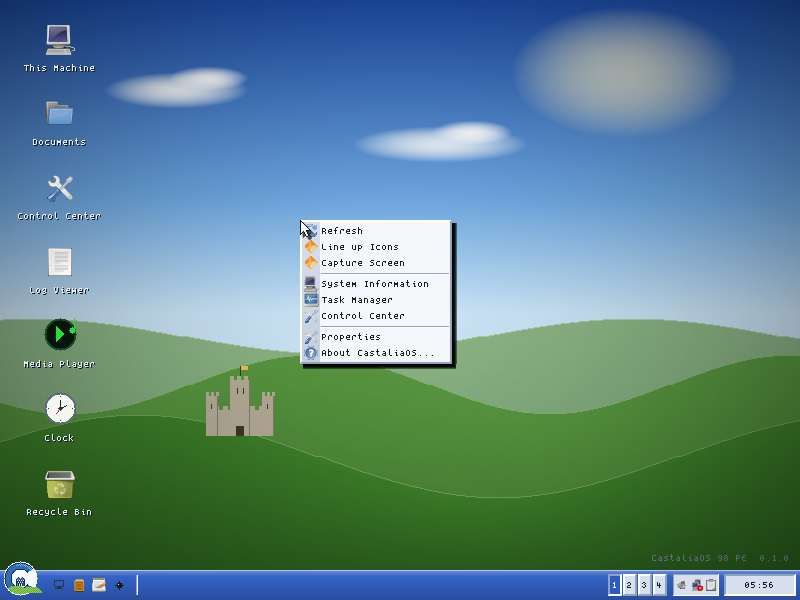
</p>

**The DOS/VESA path is verified end-to-end on real FreeDOS.** The DOS product
builds under Open Watcom (`wmake -f Makefile.dos`) and boots in QEMU: FreeDOS →
DOS/4GW → DPMI → **VESA 800×600×16** → the full composited desktop, with a live
INT 21h clock, **INT 16h keyboard** (Esc opens the launcher; arrows navigate it;
Enter launches), and **INT 33h mouse** (with a DOS mouse driver, a click opens a
window). The **File Manager, Notepad, Calculator, Log Viewer, and Control Center
have each been run on real FreeDOS by keyboard alone** — the File Manager lists
the `A:\CASTALIA` floppy over INT 21h, Notepad accepts typed text, the Calculator
computes `12 + 34 = 46`, and the Control Center renders its listbox + radio
controls. Repro: `tools/make_dos_floppy.sh` + `emulators/qemu_floppy.sh`.
That run exercised the DOS backend as it stood then; the parts changed since
(most notably VESA mode selection) are listed under "Changed since the last
verified FreeDOS run" in [TESTING.md](docs/TESTING.md) rather than assumed to
still hold.

<p align="center">
  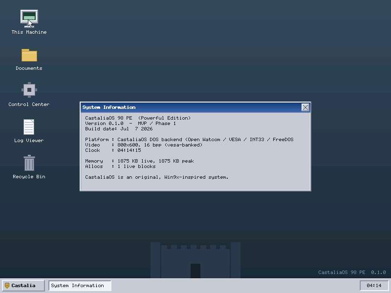
  <br><em>Not the host renderer — CastaliaOS on FreeDOS + DOS/4GW + VESA in QEMU. A mouse click on the desktop icon opened this window, which self-reports its DOS/VESA environment.</em>
</p>

<p align="center">
  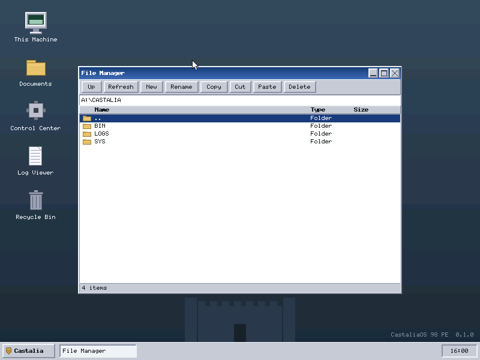
  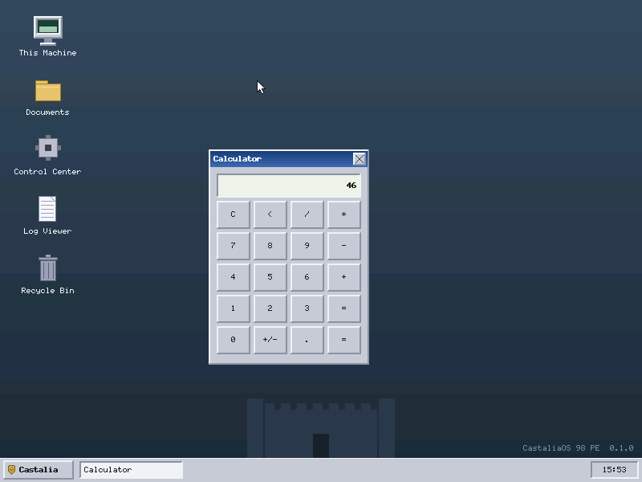
  <br><em>Both opened from the keyboard-navigable launcher on FreeDOS — no mouse. Left: the File Manager reading the real floppy filesystem. Right: the Calculator after a keyboard computation.</em>
</p>

**The extension track is underway too.** An **INSTALL.EXE** (`src/install/`)
creates `C:\CASTALIA`, backs up CONFIG.SYS/AUTOEXEC.BAT, and adds an idempotent
boot entry — with a full install→uninstall round trip host-tested. A **Sound
Blaster DAC path** now sits behind the same `snd.h` the PC speaker uses, a
**VESA linear-framebuffer fast path** speeds up present (banked fallback kept),
and a **16/256-color theme pipeline** renders themes on the EGA-16 / 3-3-2
palettes (a 16-color desktop verified at 96.6% on-palette). A **`.CAPP` add-on
package format** with a defensive validator, an authoring tool (`mkcapp`), and
startup discovery is in place alongside a versioned **plugin ABI** contract, and
an optional **packet-driver networking** seam (`net.h`) with host-tested
address/checksum helpers. The isolated **`/kernel-lab`** research track now boots
a two-stage image to **32-bit protected mode with a GDT and IDT — verified in
QEMU**. All of it stays honest about what is compiled-and-tested vs. validated
on emulator/hardware.

**The icons are pluggable.** An **icon pack** behind `[Assets] Icons=` supplies
the desktop icons, the File Manager toolbar buttons, and the taskbar Quick Launch
strip — magenta-keyed BMPs loaded by name, with a per-icon fallback to the
built-in **procedural** art for anything a pack omits. Two packs ship: the
**default** is the **Public-Domain [Tango Icon Library](THIRD_PARTY_NOTICES.md)**
(`assets/icons/tango/`, rebuilt reproducibly by `tools/build_tango_pack.sh`), and
an **all-original, MIT** set (`assets/icons/castalia/`) baked by the engine itself
(`tools/gen_iconpack.c`) is one INI line away. A stdlib-only pipeline tool
(`tools/png2bmp.py`) converts any freely-redistributable **CC0/MIT/PD** PNG set
into the same convention, so another pack drops in without code changes. The
**launcher (Start) menu and the desktop context menu** carry a per-item icon
from the pack too, so the whole shell reads as one set. See
[assets/icons/README.md](assets/icons/README.md).

<p align="center">
  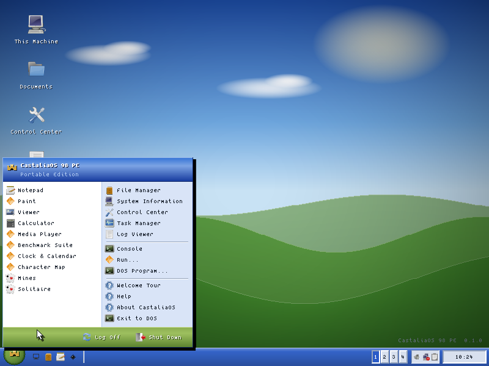
  <br><em>The launcher menu with per-item icons from the active pack — the desktop right-click menu is iconized the same way.</em>
</p>

**The system text face is pluggable too** (`[Assets] Font=`): the default is the
BSD-licensed **Spleen 5x8**, with the original hand-authored 8×8 one line away
(`Font=system`) — identical metrics, no layout change. Any ≤8-row BDF can be
baked in with `tools/bdf2font.py` (`make gen-font`).

<p align="center">
  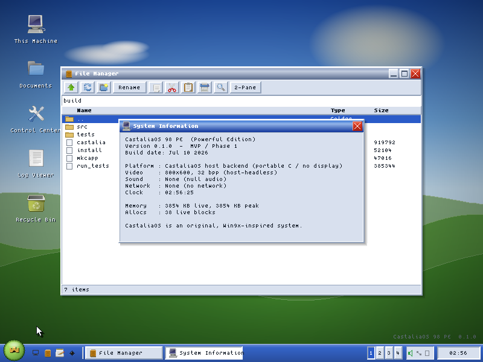
  <br><em>The default Tango pack in use — desktop icons, icon toolbar, per-window title-bar icons, and taskbar buttons that carry each app's icon. Swap to the original set with <code>make icons-demo ICONS=assets/icons/castalia</code>.</em>
</p>

See [docs/BACKLOG.md](docs/BACKLOG.md) for what compiles now vs. what's next,
and [docs/TESTING.md](docs/TESTING.md) for the reproducible QEMU steps.

## License & legal

Original code is under the [MIT License](LICENSE). Read [LEGAL.md](LEGAL.md)
and [THIRD_PARTY_NOTICES.md](THIRD_PARTY_NOTICES.md) before redistributing.
