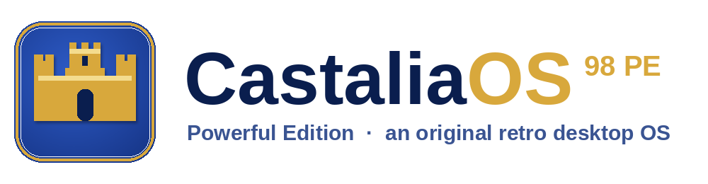

# CastaliaOS 98 PE — Press Kit

**An original, Win9x/XP‑inspired retro desktop operating system for DOS‑class PCs.**
Written from scratch in C. No Microsoft code, assets, or branding.

This folder is a complete, ready‑to‑use press kit for magazines, blogs, YouTubers,
and podcasts (PC Magazine, Hackaday, OSNews, Ars Technica, retro‑computing and
IT/geek outlets, etc.). Everything here is free to reproduce for editorial
coverage — please credit **Dave Abellan** and **Claudio di Castello**
(**Tombatossals Softworks**) and link back to the project.

> **Open the one‑page press page:** [`index.html`](index.html) — a self‑contained
> HTML page with the fact sheet, feature list, screenshot gallery, tech details,
> and roadmap. It needs no internet connection and embeds nothing external.

---

## What's in this kit

| File / folder | What it is |
|---|---|
| [`index.html`](index.html) | The one‑page press page (start here). |
| [`CastaliaOS-98-PE-PressKit.pdf`](CastaliaOS-98-PE-PressKit.pdf) | The whole kit as a single printable PDF. |
| [`fact-sheet.md`](fact-sheet.md) | The quick reference: who, what, when, where, how much. |
| [`description.md`](description.md) | Boilerplate descriptions (short / medium / long) to paste into an article. |
| [`features.md`](features.md) | The full feature list, grouped and quotable. |
| [`technical.md`](technical.md) | Architecture, the tech we used, and how it's built. |
| [`roadmap.md`](roadmap.md) | Where the project is going — vision and phased plan. |
| [`history.md`](history.md) | The story and the "why". |
| [`press-release.md`](press-release.md) | A ready‑to‑run announcement. |
| [`contact.md`](contact.md) | How to reach us and request assets or a build. |
| [`logo/`](logo/) | Logo and crest in SVG + transparent PNG, light and dark. The mark (`castaliaos-icon-*.png`, `favicon.ico`) is baked from the shell's own drawing code with `make gen-logo`, so it is pixel-identical to the Start button. |
| [`screenshots/`](screenshots/) | High‑resolution PNG screenshots (native 800×600). |
| [`media/trailer.gif`](media/trailer.gif) | An animated tour of the desktop, apps, and the live benchmark. |
| [`media/clips/`](media/clips/) | Six short **product‑demo videos** (WebM) recorded live — a human‑paced walkthrough of the Start menu + window snap, file drag‑and‑drop, the benchmark, the media player, the Solitaire win cascade, and desktop‑icon rearranging. Regenerate (and get matching GIFs) with `sh tools/make_clips.sh`. |

## At a glance

- **Title:** CastaliaOS 98 PE ("Powerful Edition")
- **Developer / Publisher:** Tombatossals Softworks
- **Creators:** Dave Abellan · Claudio di Castello
- **Type:** Original retro desktop environment / hobby operating system
- **Platforms:** Real DOS (386+), emulators (DOSBox, 86Box, PCem, QEMU), plus a headless host build for CI
- **Price:** Free — open source (MIT)
- **Status:** In development, public preview — v0.1.0 (MVP / Phase 1)
- **Written in:** C (portable C89), ~37,800 lines across 145 files
- **Contact:** hello@tombatossalssoftworks.com · tombatossalssoftworks.com

## Terms of use

You may use the text, logos, and screenshots in this kit for editorial coverage
of CastaliaOS free of charge. Please don't alter the logo's proportions or
colors, and don't imply endorsement of unrelated products. The screenshots show
100% original artwork and UI — there is no Microsoft code, art, or branding in
CastaliaOS.
